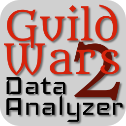

# Guild Wars 2 Data Analyzer

[](https://travis-ci.org/Luke-Draper/guild-wars-two-data-analyzer)
[](https://coveralls.io/github/Luke-Draper/guild-wars-two-data-analyzer?branch=master)
[](https://david-dm.org/Luke-Draper/guild-wars-two-data-analyzer?type=dev)

> A TypeScript library to analyze the items, crafting recipes, and trading post prices of Guild Wars 2 and provide a searchable data tree.

This library reads the Guild Wars 2(GW2) API and calculates a recommended buy and sell price for each item. It then uses those prices and the crafting recipe tree to find the minimum purchase price of components to craft into each item. Finally it provides an interface to search this data.
In other words you can figure out the highest profit item to sell if you have 45 gold to spend on crafting supplies and can't take more than 15 minutes to craft on a free to play account.

## Use it in your project

Add to your project:

```shell
npm install guild-wars-two-data-analyzer
```

Create an analyzer and register a callback when it is ready to be searched:

**TODO** Edit once setup function is complete.

```typescript
analyzer = GW2DA.setup({ callbackFunction })
```

## Developing

If you'd like to edit something just clone the repo and install:

```shell
git clone https://github.com/Luke-Draper/guild-wars-two-data-analyzer.git DevelopmentDirectory
cd DevelopmentDirectory
npm install
```

This installs the dependencies and sets up the development environment.

## Features

What's all the bells and whistles this project can perform?

- What's the main functionality
- You can also do another thing
- If you get really randy, you can even do this

## Contributing

If you'd like to contribute, please fork the repository and use a feature branch. Pull requests are warmly welcome.
To parody a certain space doctor, "I'm a programmer not a statistician!" I'll be implementing the analysis algorithms I understand to make a price recommendation however if you've got improvements in that area It would be greatly appreciated.

## Links

Even though this information can be found inside the project on machine-readable
format like in a .json file, it's good to include a summary of most useful
links to humans using your project. You can include links like:

- Repository: https://github.com/Luke-Draper/guild-wars-two-data-analyzer
- Issue tracker: https://github.com/Luke-Draper/guild-wars-two-data-analyzer/issues

## Licensing

The code in this project is licensed under MIT license.
